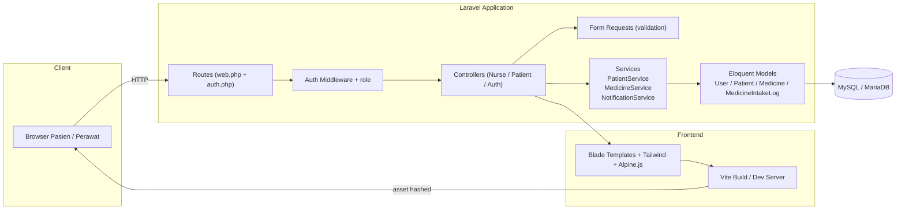
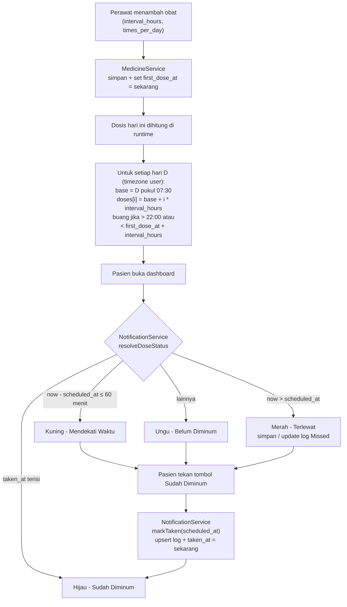
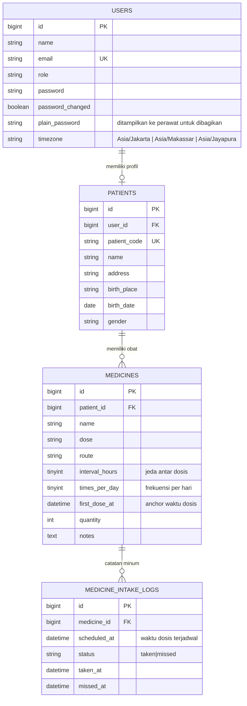

# NoDebat

NoDebat adalah aplikasi web sederhana untuk manajemen penggunaan obat pasien. Aplikasi memudahkan perawat mendata pasien beserta jadwal obatnya dan memberi pasien pengingat kapan harus minum obat melalui status warna yang jelas pada dashboard mereka. Penjadwalan dosis dihitung otomatis oleh sistem berdasarkan rentang waktu (jam) dan frekuensi (kali per hari) yang diisi perawat saat menambahkan obat.

## Stack Teknologi

| Kategori | Teknologi | Versi |
| --- | --- | --- |
| Bahasa | PHP | 8.2+ |
| Framework Backend | Laravel | 12 |
| Auth Scaffolding | Laravel Breeze (logic-only, view bawaan dihapus) | 2.x |
| Templating | Blade | bawaan Laravel 12 |
| CSS | Tailwind CSS | 4 |
| Interaktivitas | Alpine.js | 3 |
| Bundler | Vite | 7 |
| Database | MySQL / MariaDB | 8 / 10.4+ |
| Testing | Pest | 3 |
| Code Style | Laravel Pint | 1 |

## Fitur Utama

| Area | Fitur |
| --- | --- |
| Autentikasi | Login dengan email + password, logout, ubah kata sandi sendiri |
| Manajemen Pengguna | Kredensial pasien dibuat otomatis sistem, dapat dilihat dan disalin via toggle, dapat direset oleh perawat |
| Role | Perawat (full kelola data) dan Pasien (lihat jadwal dan tandai sudah diminum) |
| Data Pasien | Nama, kode pasien, alamat, tempat lahir, tanggal lahir, umur, jenis kelamin |
| Data Obat | Nama, dosis, rute, rentang waktu (jam), frekuensi per hari, qty, keterangan |
| Penjadwalan Dosis | Sistem menghitung waktu setiap dosis dari `first_dose_at + index * interval_hours`, di-anchor ke time-of-day tiap harinya |
| Notifikasi Warna | Hijau (sudah minum), Kuning (mendekati dalam 1 jam), Merah (terlewat), Ungu (belum waktunya) |
| Catatan Otomatis | Sistem membuat catatan terlewat otomatis ketika jam dosis lewat tanpa intake; menyimpan tanggal pasien menekan tombol "Sudah Diminum" |
| Dashboard Perawat | Kartu jumlah pasien, pasien laki - laki, pasien perempuan, daftar dosis mendekati waktu, daftar dosis terlewat (lama keterlambatan dihitung jam) |
| Navigasi | Top navbar di desktop, bottom navigation dengan ikon di mobile |
| Pola Code | Service layer, form request, Blade components reusable |

## Indikator Status Dosis

| Warna | Status | Kondisi |
| --- | --- | --- |
| Hijau | Sudah Diminum | `taken_at` log terisi |
| Kuning | Mendekati Waktu | Sekarang < `scheduled_at` dan selisih ≤ 60 menit |
| Merah | Terlewat | Sekarang > `scheduled_at` dan log tidak punya `taken_at` |
| Ungu | Belum Diminum | Sekarang < `scheduled_at` dan selisih > 60 menit |

## Aturan Penjadwalan Dosis

| Aturan | Nilai |
| --- | --- |
| Jam aktif (hardcoded) | 07:30 - 22:00 (local user) |
| Tolak ukur (`first_dose_at`) | Waktu perawat menambahkan obat |
| Countdown dosis pertama | `first_dose_at + interval_hours` |
| Dosis ke-i per hari | `(hari D pukul 07:30) + i * interval_hours` (i = 0..times_per_day-1) |
| Dosis dibuang jika | Melewati 22:00 atau sebelum countdown selesai |

## Zona Waktu

| Kode | Identifier | Wilayah |
| --- | --- | --- |
| WIB | `Asia/Jakarta` | Indonesia Barat (UTC+7) |
| WITA | `Asia/Makassar` | Indonesia Tengah (UTC+8) |
| WIT | `Asia/Jayapura` | Indonesia Timur (UTC+9) |

Setiap user (perawat / pasien) memilih zona waktu di halaman Akun. Penjadwalan dosis dan tampilan jam mengikuti zona waktu user.

## Kebutuhan Sistem

| Komponen | Versi minimal |
| --- | --- |
| PHP | 8.2 |
| Composer | 2.x |
| Node.js | 18 |
| NPM | 9 |
| MySQL | 8 |
| MariaDB (alternatif MySQL) | 10.4 |
| Ekstensi PHP wajib | BCMath, Ctype, JSON, Mbstring, OpenSSL, PDO, PDO MySQL, Tokenizer, XML |

## Arsitektur Sistem

## Flow Penjadwalan dan Notifikasi

## ERD Database

## Cara Instalasi

| Langkah | Perintah |
| --- | --- |
| 1. Salin environment | `cp .env.example .env` |
| 2. Sesuaikan kredensial DB | edit `DB_DATABASE`, `DB_USERNAME`, `DB_PASSWORD` di `.env` |
| 3. Instal dependency PHP | `composer install` |
| 4. Instal dependency Node | `npm install` |
| 5. Generate application key | `php artisan key:generate` |
| 6. Migrasi dan seeder | `php artisan migrate --seed` |
| 7. Build asset produksi | `npm run build` |
| 8. Jalankan dev (asset hot reload) | `npm run dev` |
| 9. Jalankan PHP server | `php artisan serve` |
| 10. Bersamaan: server + queue + log + vite | `composer run dev` |

## Akun Default

| Role | Email | Password |
| --- | --- | --- |
| Perawat | `perawat@nodebat.local` | `password` |

Pasien tidak diseed. Buat lewat menu Tambah Pasien — kredensial akan otomatis dibuat dan ditampilkan pada halaman detail pasien.

## Penggunaan Awal

| Tahap | Aksi |
| --- | --- |
| 1 | Login sebagai perawat menggunakan kredensial seeder |
| 2 | Tambahkan pasien dari menu Pasien — kredensial muncul di halaman detail |
| 3 | Bagikan email + password ke pasien |
| 4 | Tambahkan obat pada halaman detail pasien (isi interval jam dan frekuensi per hari) |
| 5 | Pasien login dan menandai dosis yang sudah diminum |
| 6 | Perawat memantau dashboard untuk dosis yang mendekati waktu dan dosis yang terlewat |

## Struktur Direktori

| Path | Isi |
| --- | --- |
| `app/Models` | Eloquent models (User, Patient, Medicine, MedicineIntakeLog) |
| `app/Services` | Service layer (PatientService, MedicineService, NotificationService) |
| `app/Enums/IntakeStatus.php` | Enum status notifikasi (Taken, Upcoming, Missed, Pending) |
| `app/Http/Controllers` | Controllers per role: `Auth`, `Nurse`, `Patient`, dan `DashboardController` |
| `app/Http/Requests/Nurse` | Form request untuk validasi store / update pasien dan obat |
| `app/Http/Middleware/EnsureUserHasRole.php` | Middleware `role:perawat` / `role:pasien` |
| `resources/views/components` | Blade components reusable (navbar, bottom-nav, card, stat-card, status-badge, credentials-callout, form fields, layouts) |
| `routes/web.php` | Pengelompokan route berdasarkan role |
| `database/migrations` | Skema users, patients, medicines, medicine_intake_logs (termasuk migrasi schedule per-dose) |

## Lisensi

Aplikasi ini dilisensikan di bawah MIT License.
